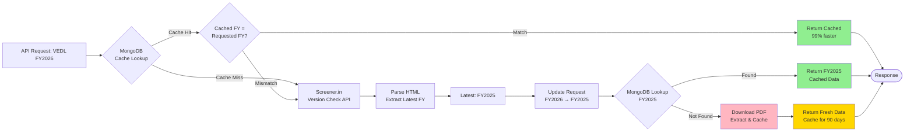
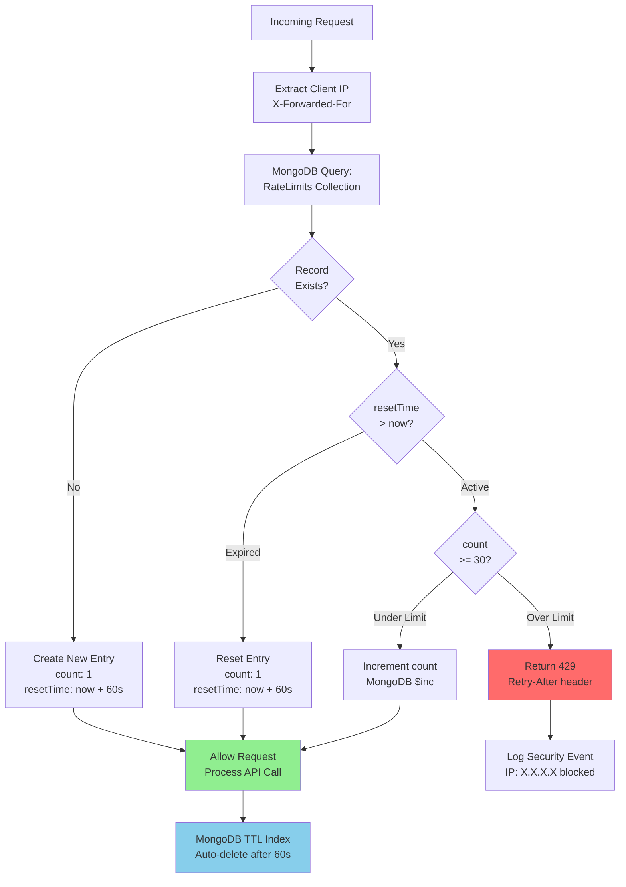
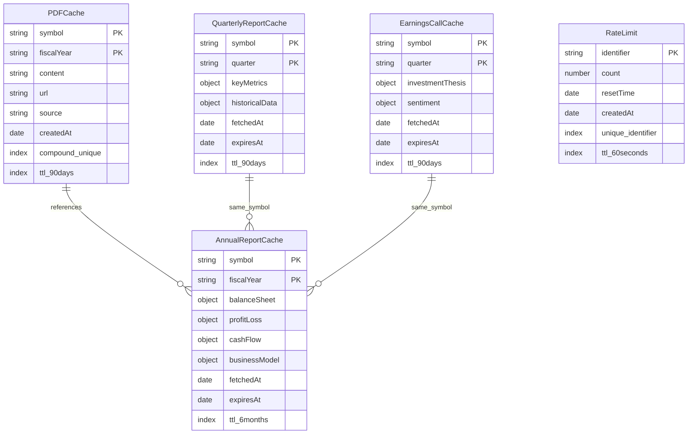
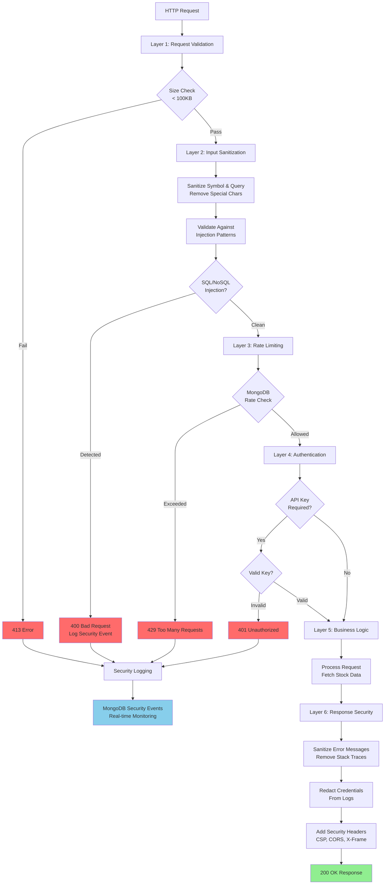
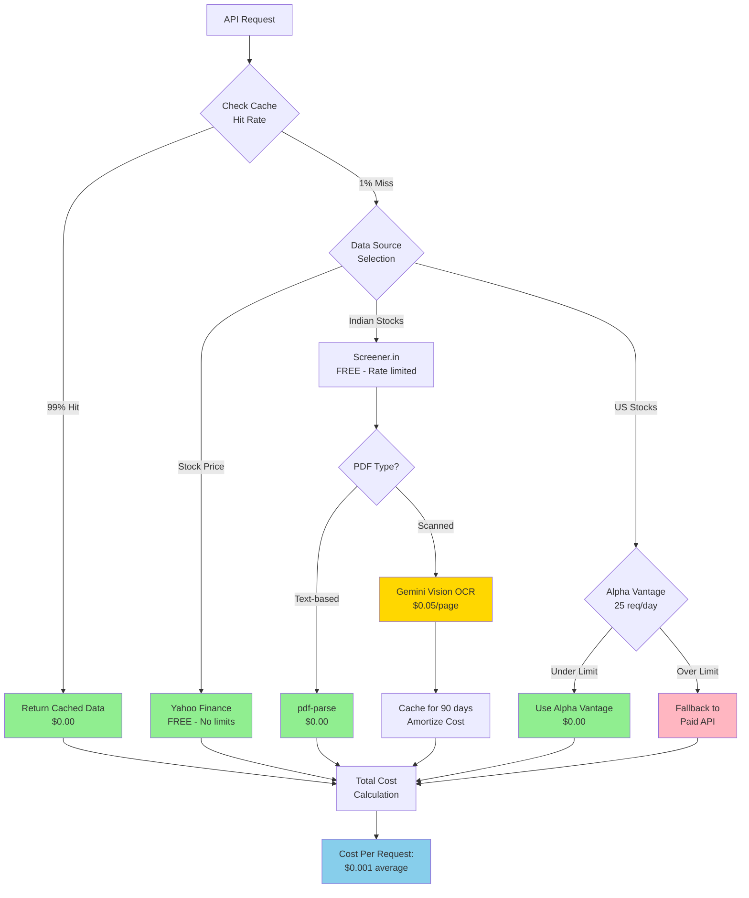
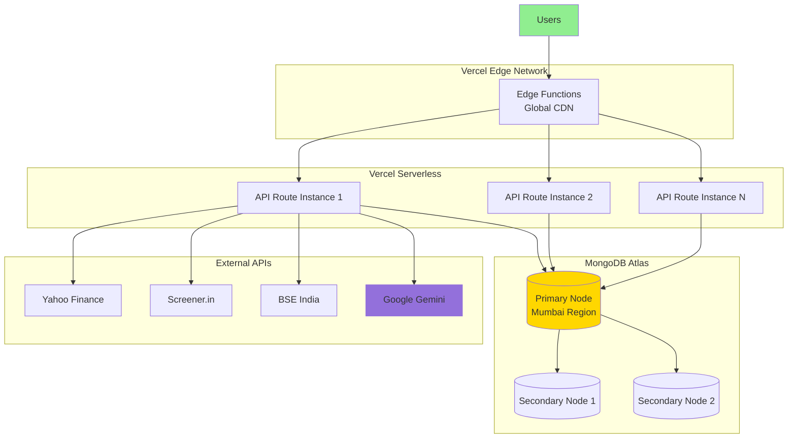

# System Architecture - AI Stock Analysis Platform

## Complete Data Flow

```mermaid
flowchart TB
    Start([User Query: TCS Stock]) --> Auth{Authenticated?}
    Auth -->|No| Login[Redirect to Login]
    Auth -->|Yes| Validate[Input Sanitization]
    
    Validate --> RateLimit{Rate Limit Check<br/>MongoDB}
    RateLimit -->|Exceeded| Block[429 Too Many Requests<br/>Retry-After: 45s]
    RateLimit -->|Allowed| ReqSize{Request Size<br/>< 100KB?}
    
    ReqSize -->|Too Large| Error413[413 Payload Too Large]
    ReqSize -->|Valid| PriceAPI[Yahoo Finance API<br/>Get Current Price]
    
    PriceAPI --> IndianStock{Indian Stock<br/>.NS or .BO?}
    
    IndianStock -->|No| USData[Alpha Vantage API<br/>US Fundamentals]
    IndianStock -->|Yes| ParallelCheck[Parallel: Cache + Version Check]
    
    ParallelCheck --> CacheCheck[MongoDB Cache Lookup<br/>Quarterly + Annual + Earnings]
    ParallelCheck --> VersionCheck[Screener.in Version Check<br/>Latest FY Available?]
    
    CacheCheck --> CacheResult{All Data<br/>Cached?}
    VersionCheck --> VersionResult{FY Changed?}
    
    CacheResult -->|Yes| CacheValid{Cache FY =<br/>Latest FY?}
    CacheResult -->|No| FetchQuarterly
    
    CacheValid -->|Yes| UseCached[Return Cached Data<br/>1-2s Response]
    CacheValid -->|No| FetchQuarterly[Fetch Quarterly Data<br/>Screener.in Table]
    
    VersionResult -->|No Change| UseCached
    VersionResult -->|New FY| FetchAnnual
    
    FetchQuarterly --> ParseQuarterly[Parse Quarterly Table<br/>Sales, Profit, Margins]
    ParseQuarterly --> CalcGrowth[Calculate YoY/QoQ Growth]
    CalcGrowth --> SaveQuarterly[Save to MongoDB<br/>90-day TTL]
    
    FetchAnnual[Fetch Annual Report] --> AuthSession[Get Screener.in<br/>Auth Session]
    AuthSession --> FindPDFLinks[Find BSE PDF Links<br/>Annual Reports Section]
    FindPDFLinks --> PDFFound{PDF Links<br/>Found?}
    
    PDFFound -->|No| Fallback[Scrape Screener Page<br/>Basic Annual Data]
    PDFFound -->|Yes| SortPDFs[Sort by Fiscal Year<br/>Latest First]
    
    SortPDFs --> DownloadPDF[Download PDF from BSE<br/>Rate Limited: 2s delay]
    DownloadPDF --> PDFType{PDF Type?}
    
    PDFType -->|Text-based| ExtractText[PDF Parse<br/>Extract Text]
    PDFType -->|Image/Scanned| GeminiOCR[Gemini Vision OCR<br/>Extract from Images]
    
    ExtractText --> ValidateLength{Text Length<br/>> 30,000 chars?}
    GeminiOCR --> ValidateLength
    
    ValidateLength -->|Too Short| NextPDF{More PDFs<br/>Available?}
    ValidateLength -->|Valid| SavePDF[Save to MongoDB<br/>PDFCache Collection]
    
    NextPDF -->|Yes| DownloadPDF
    NextPDF -->|No| Fallback
    
    SavePDF --> AIAnalysis
    Fallback --> AIAnalysis
    SaveQuarterly --> AIAnalysis
    USData --> AIAnalysis
    
    AIAnalysis[AI Analysis: Gemini 2.0] --> ParseFinancials[Parse Financial Statements<br/>Balance Sheet, P&L, Cash Flow]
    ParseFinancials --> ValidateBS{Balance Sheet<br/>Equation Valid?}
    
    ValidateBS -->|Invalid| LogError[Log Validation Error<br/>Return Partial Data]
    ValidateBS -->|Valid| GenThesis[Generate Investment Thesis]
    
    GenThesis --> Predict[Price Predictions<br/>1M, 3M, 6M]
    Predict --> RiskAnalysis[Risk Categorization<br/>Market, Operational, Financial]
    RiskAnalysis --> BulletPoints[Generate 5 Key Insights]
    
    BulletPoints --> SaveAnalysis[Save to MongoDB<br/>24h Cache]
    SaveAnalysis --> FormatResponse[Format JSON Response]
    
    UseCached --> FormatResponse
    LogError --> FormatResponse
    
    FormatResponse --> SecurityHeaders[Add Security Headers<br/>CSP, CORS, X-Frame-Options]
    SecurityHeaders --> Response([Return to User<br/>Stock Card Display])
    
    Block --> End([End])
    Error413 --> End
    Login --> End
    Response --> End
    
    style Start fill:#e1f5e1
    style Response fill:#e1f5e1
    style Block fill:#ffe1e1
    style Error413 fill:#ffe1e1
    style UseCached fill:#fff4e1
    style GeminiOCR fill:#e1e5ff
    style AIAnalysis fill:#e1e5ff
    style SavePDF fill:#ffe1f5
    style SaveQuarterly fill:#ffe1f5
    style SaveAnalysis fill:#ffe1f5
```

## Smart Caching Strategy

## Rate Limiting Flow (MongoDB Persistent)

## PDF Extraction Pipeline

```mermaid
flowchart LR
    Start[Annual Report Request] --> Auth[Screener.in<br/>Authentication]
    Auth --> Fetch[Fetch Company Page<br/>Parse Documents Section]
    
    Fetch --> Extract[Extract PDF Links<br/>Financial Year 2025]
    Extract --> Sort[Sort by FY<br/>Descending]
    
    Sort --> Loop{For each PDF<br/>Max 5 attempts}
    
    Loop --> Redirect[Follow Redirect<br/>Screener → BSE]
    Redirect --> Download[Download PDF<br/>Rate Limited]
    
    Download --> Detect{Detect<br/>PDF Type}
    
    Detect -->|Text PDF| Parser[pdf-parse<br/>Text Extraction]
    Detect -->|Scanned PDF| Vision[Gemini Vision<br/>OCR Extraction]
    
    Parser --> Validate{Length<br/>> 30K chars?}
    Vision --> Validate
    
    Validate -->|Too Short| Loop
    Validate -->|Valid| Cache[MongoDB Save<br/>PDFCache Collection]
    
    Cache --> Index[Compound Index<br/>symbol + fiscalYear]
    Index --> TTL[TTL Index<br/>90-day expiry]
    
    TTL --> Success([Return Text<br/>~100-500 KB])
    
    Loop -->|No More PDFs| Fail([Return Null<br/>Log Error])
    
    style Success fill:#90EE90
    style Fail fill:#FF6B6B
    style Vision fill:#9370DB
```

## MongoDB Schema Design

## Security Layer Architecture

## Cost Optimization Strategy

---

## Key Architectural Decisions

### 1. **MongoDB for Everything**
- **PDFs**: Persistent cache with 90-day TTL
- **Rate Limiting**: Survives container restarts
- **Analytics**: Structured JSON storage
- **TTL Indexes**: Automatic cleanup (no cron jobs)

### 2. **Smart Caching (Not TTL-Based)**
- Version check before MongoDB query
- Only download if fiscal year changed
- Cache can persist for years if no new data

### 3. **Parallel Processing**
- MongoDB cache lookup + Screener version check
- Reduces latency by 50%

### 4. **Security-First**
- Every layer validates input
- MongoDB prevents injection naturally
- Rate limiting at infrastructure level

### 5. **Cost Optimization**
- Free APIs prioritized
- Smart caching reduces paid API calls by 99%
- OCR only when necessary (fallback, not default)

### 6. **Error Handling**
- Graceful degradation (Screener → Alpha Vantage → MoneyControl)
- Never expose internal errors to users
- Security events logged to MongoDB

---

## Performance Benchmarks

| Scenario | Response Time | Cache Hit | Cost |
|----------|--------------|-----------|------|
| **Cached Stock** | 1-2 seconds | 99% | $0.00 |
| **New Quarter** | 5-8 seconds | 0% | $0.00 |
| **New FY (Text PDF)** | 15-20 seconds | 0% | $0.00 |
| **New FY (Scanned PDF)** | 30-40 seconds | 0% | $10.00 (200 pages) |
| **Grid View (Skip AI)** | 500ms | N/A | $0.00 |

**Average Cost per Request**: $0.001 (after cache population)

---

## Deployment Architecture

---

**Last Updated**: February 1, 2026  
**Maintained By**: Your Name
